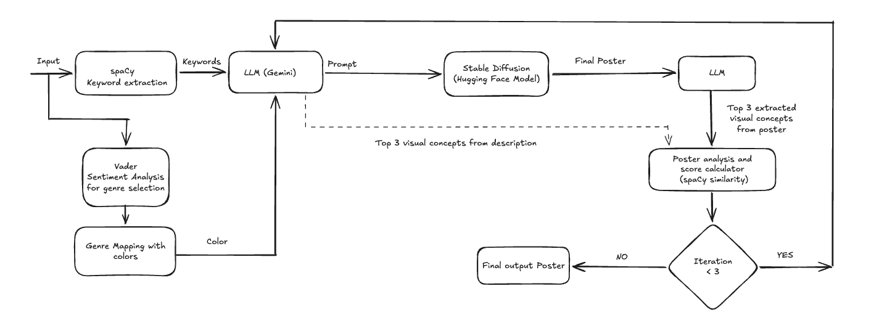

## Introduction
This project aims to generate a minimal poster with a title and description as input. The system extracts the necessary details from the description. The internal evaluation uses an LLM guided by a reward function to improve the quality of the poster, inspired by reinforcement learning. This project analyses the potential of using large language models (LLMs) with reinforcement learning in automating difficult tasks with less human intervention

## System Design

## Components
- Input - The input for the system is the title and description.
- spaCy - It is a free, open-source library for NLP in Python.
- VADER - It is a rule-based sentiment analysis tool.
- Genre Mapping - Based on the sentiment chosen from VADER, the corresponding color palette for the poster is mapped. Currently, it is a hard-coded mapping.
- LLM (Gemini) - For extracting the top three visual concepts and generating the prompt for Stable Diffusion, an LLM is used.
- Stable Diffusion - It is an open-source generative AI model that creates an image from a text description. Due to the limitations in time and hardware, a pretrained model from Hugging Face is used.
- Pillow - It is a powerful image processing library. In this system, it is used to add the title to the poster.
- YOLO - It is a real-time object detection algorithm that detects and identifies objects in the image.
- Poster analysis and score calculator - Based on the detected objects from YOLO and the initial top three visual concepts extracted from the description by the LLM, a similarity score is calculated using spaCy, and then its average is taken.
- Final output poster - After three iterations of poster generation, the poster with the maximum score is given as the final output to the user.

## Component Interaction

The user enters the title and description as input. The description is then processed by spaCy and VADER. spaCy extracts the keywords, and the VADER tool analyses and generates a score for positive, negative, neutral, and compound sentiments. From this, the sentiment with the maximum score is chosen. Based on the sentiment, a hard-coded genre mapping generates the base color palette for the poster.

The extracted keywords and color palette are then given as input to the LLM (Gemini) to choose the top three visual concepts for the poster and the prompt for the Stable Diffusion (SD) model
from Hugging Face.
The output prompt from the LLM is given as the input prompt for the SD model. Once the base image is generated by the SD model, the output is passed to the Pillow library, which addsthe respective title to the poster.

After generating the final poster with the title from Pillow, this poster is fed into YOLO, which extracts the objects from the poster. With the top three confidence detections from YOLO and the initial top three visual concepts from the LLM, a similarity score is calculated using spaCy, and then the average is taken. This value is stored as a dictionary along with the respective poster.

The cycle from LLM to the score calculator runs for 3 iterations. The score from the score calculator is given as a reward to the LLM, which is then asked to improve the score by modifying the
input prompt or using another set of visual concepts. This approach is inspired by reinforcement learning, where the similarity score acts as a reward signal to guide iterative prompt refinement.
This cycle acts as an internal evaluation for the system.

